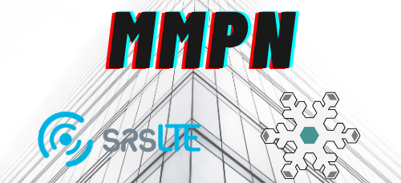

  

# MMPN srsLTE Remote Sensor Guide
> ## STEP 1: Reserve Resources
>
> * Reserve srsLTE experiment resources  **ota_srslte** profile
> * Reserve a PC with **single-pc** profile
>

> ## STEP2: Connect to Nodes
>
> * In **Local_Scripts** run **node_start.sh** to open up shells for EPC, eNB, UE, KafkaServer
>    * This asks for your POWDER username, location of data center, PC number(s) for the EPC(s)/eNB(s), PC number for the Kafka server, and location of UE(s) (bookstore, meb, etc).
>
>
> * Clone this repo onto the node

> ## STEP 3: Spin up Kafka server
> _NOTE: By default, log retention is 1 hour. Edit **log.retention.ms** in **Kafka/config/server.properties** file to change this._
> * In **Node_Scripts** run in order:
>     * **Install_dependencies.sh**
>       * If choosing to run InfluxDB on the same node, the option to do so is here
>     * **Kafka_Scripts/kafka _up.sh** – This starts ZooKeeper/Kafka daemons. **kafka_down.sh** terminates the servers.
> * _Due to networking issues on POWDER, run this command:_ **sudo ip route add 155.98.47.0/24 via 155.98.36.204**

> ## STEP 4: Spin up srsLTE
> _NOTE: Set your **node identifier** to be of the form: **[node type][#]** (Ex. ue1)_
> * For each UE
>    * On the EPC node: add entries for distinct **keys** and **IMSIs** in **/etc/srslte/user_db.csv**
>    * On each UE: change the key and IMSI to ensure there are **no duplicates**
> * For each node (EPC/eNB/UE)
>    * In **Node_Scripts/** run **Install_dependencies.sh**
>       * Select "No" for the InfluxDB installation
>    * **Node_Scripts/srsLTE_Scripts** run **srsLTE_top.sh**
>    * Provide the Kafka server public IP (the value for advertised.listeners in the server.properties file)

> ## STEP 5: Consume/process data locally
> * In **Local_Scripts/Data_Processor** run **consumer_top.sh** and specify the Kafka server IP
>    * This script creates a consumer for each topic and reads in the log files

> ## STEP 6: Visualize data in InfluxDB
> * Login to the setup page using **port 8086** at the IP of the node running InfluxDB (Kafka server node by default)
> * Setup basic credentials for this database (username, password, name of DB)
> * In **Local_Scripts/Data_Processor/Reader/influx_reader.py** change the _token_, _org_, and _bucket_ variables
>   * _token_ comes from InfluxDB GUI: Data > Token > User's Token > Copy to clipboard
>   * _org_ is what you've named the DB
>   * _bucket_ is what you've named the bucket
> * In InfluxDB GUI under **Boards**
>   * Import the UE/eNB dashboards
>     * Create Dashboard > Import Dashboard
>       * Dashboard JSON files are in **InfluxDB/** as **enb_dash.json** and **ue_dash.json**
